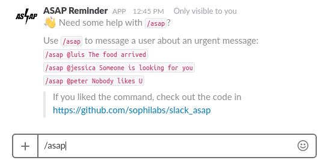
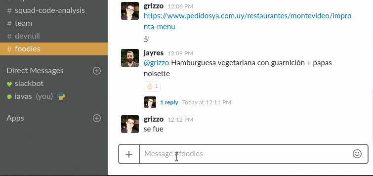
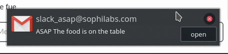
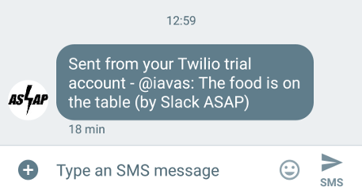

# Slack ASAP

[](https://travis-ci.org/sophilabs/slack-asap)


Slack ASAP is an Slack Slash Command we use at [Sophilabs](https://sophilabs.co) to notify our coworkers about things *as soon as possible*. The command will send the contact SMS messages, emails and Slack private messages. It can be configured to add more *notifiers*, or even remove them.

It works as a [Cowboy](https://github.com/ninenines/cowboy) Server listening for the Slack Slash Command, that is referenced by the [Slack ASAP](https://sophilabs.slack.com/apps/A6QJPCSR2-asap-reminder) application. The slack app registers an slash command, that calls the server, which in turn calls each of the notifiers passing the slack parsed message. A Notifier, can do anything with the message, and even add attachments to the command result. The project comes with some common actions like sending emails using [Bamboo](https://github.com/thoughtbot/bamboo), and SMS mesages with [ExTwilio](https://github.com/danielberkompas/ex_twilio). Some other notifiers that can be included are: making phone calls, sending a Google Hangouts message, or even playing an synthetized voice with the message in the speakers. The package itself fetchs the profile information, about the receiver and make the heavy lifting of exposing all the information behind the `SlackAsap.Message` struct.

A basic worflow is described:
1. Cowboy receives the Slash Command request
2. Transform the JSON parameters into a `SlackAsap.Message` struct
3. Calls the SlackAsap.Core notifier (checks Slack token and parses the command)
4. If it is a help command, it simply prints the usage information
5. If it is a message, it calls the other notifiers, one by one passing the message from the previous Notifier to the next.
6. It replies to the request with the resulting message after being handled by the last Notifier.

## Usage



The command syntax is the following:

```/asap @username <message>```

In the picture below I'm sending an `/asap` message to myself.



You receive an email too, and a SMS message.




# Configuration

The app itself requires a significant amount of variables, mostly for configuring each notifier API tokens and ids. The following fragment shows a sample `config.exs` file. The main part is the `notifiers:` array which must have the ones which want to be enabled. The package itself comes with some basic ones that can optionally enabled.

```elixir

# Required configuration
config :slack_asap, token: "<put-value-here>",
                    port: 4000,
                    notifiers: [
                      SlackAsap.TwilioSMS,
                      SlackAsap.SlackMessage,
                      SlackAsap.BambooEmail,
                      # More notifiers here
                    ],
                    slack_interface: Slack

# SlackAsap.SlackMessage specific configuration
config :slack, api_token: "..."

# SlackAsap.BambooEmail specific configuration
config :slack_asap, SlackAsap.BambooEmail,
                    adapter: Bamboo.LocalAdapter,
                    email_from: "some@email.com"

# SlackAsap.TwilioSMS specific configuration
config :slack_asap, SlackAsap.TwilioSMS,
                    adapter: ExTwilio,
                    phone_number: "+12672145274",
                    default_country: "UY"
config :ex_twilio, account_sid: "...",
                   auth_token: "..."
```

## Notifiers

A notifier is a module that defines a `handle(Message) :: Message` function that is called once per received command:

```elixir
defmodule ConsoleNotifier do
  def handle(message) do
    IO.puts("Hello, I'm notifying via Console: #{get_asap_message(message)}")
    message
  end
end
```


## Installation

The package can be installed by adding `slack_asap` to your list of dependencies in `mix.exs`, and don't forget to add the applications, which depends on the notifiers you will run. The following example shows the basic packages needed to be included for the notifiers built into the Slack ASAP package.

```elixir
def deps do
  [
    {:slack_asap, github: "sophilabs/slack-asap"}
  ]
end

def application do
  [
    applications: [:bamboo, :cowboy, :plug, :httpoison, :ex_twilio, :ex_phone_number],
    extra_applications: [:logger],
    mod: { SlackAsap, [ start_server: Mix.env != :test ]}
  ]
end
```

## TODO

Basic functionality is on place, but this is still a work in progress, in alpha state. Some steps to make this project a little more solid are:

* Execute Slack, SMS, and Email notifiers in the background.
* Communicate the sender about the result of each Notifiers, for example tell if the SMS was sent, or the Email was read.
* Generate [ExDoc](https://github.com/elixir-lang/ex_doc) documentation
and publish it on [HexDocs](https://hexdocs.pm).
* Implement Credo checks.
* Make package available on [Hex](https://hex.pm/docs/publish).


## Last words

This project shows how easy it is to make a Slack command in Elixir that can solve some real world problem. Any contributions are welcome, via issues or via Pull Requests.

## License

Slack ASAP is MIT Licensed. Copyright (c) 2017 Sophilabs, Inc.


## Credits


This project is maintained and funded by Sophilabs, Inc. The names and logos for sophilabs are trademarks of sophilabs, inc.
